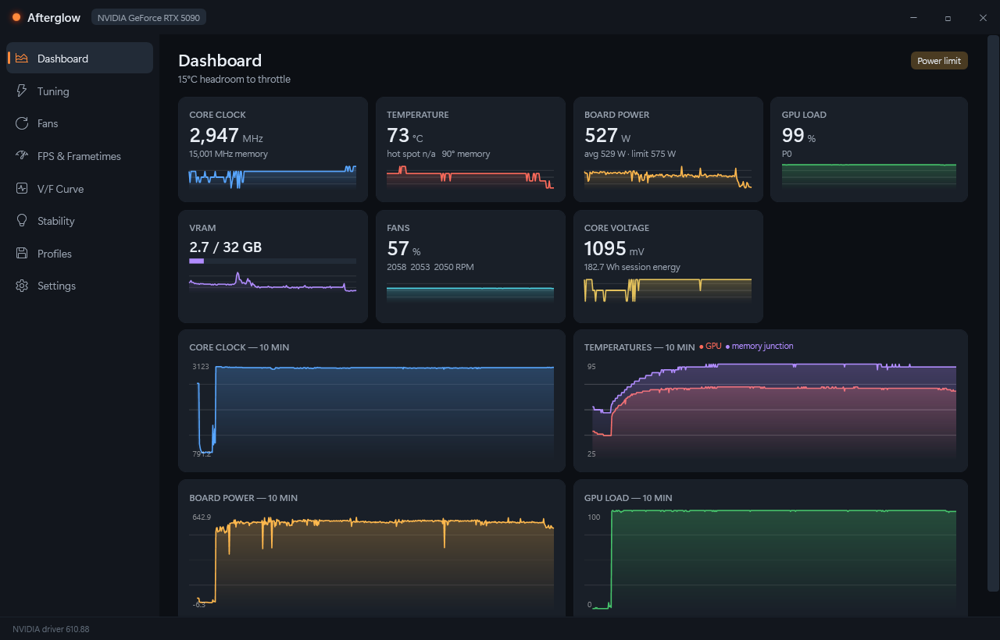
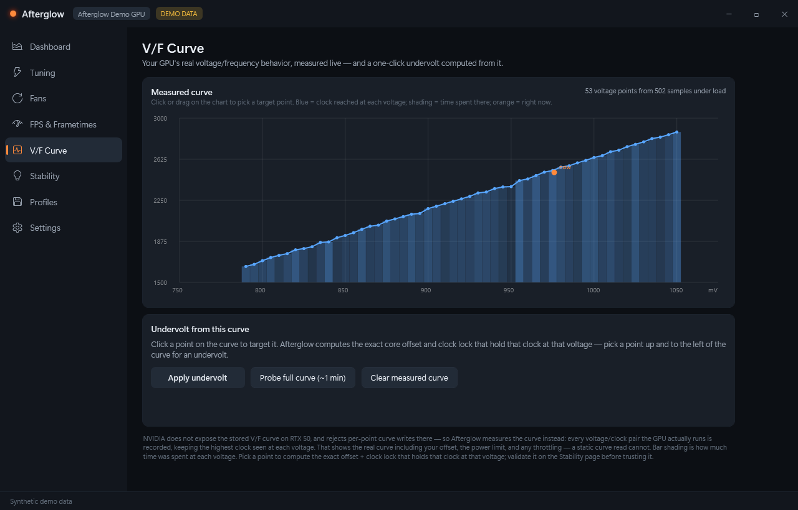

<p align="center">
  
</p>

<h1 align="center">Afterglow</h1>

<p align="center">
  <b>Open-source tuning and monitoring for NVIDIA RTX GPUs.</b><br/>
  Overclocking, undervolting, per-fan curves, FPS metrics, per-game profiles, and a built-in
  stability lab — with no kernel drivers, no telemetry, no accounts, and no bundled bloat.
</p>

<p align="center">
  
  <br/>
  <sub>Real capture: an RTX 5090 riding through a built-in burn test — no synthetic data.</sub>
</p>

---

## Why Afterglow exists

Every mainstream GPU tuning tool on Windows is closed source, and most ship a kernel driver
with a CVE history (MSI Afterburner's `RTCore64.sys` is on the loldrivers blocklist and gets
Afterburner banned by some anticheats; GPU-Z and vendor suites have had their own driver CVEs).
Meanwhile the features gamers actually ask for — per-game profiles, honest Blackwell sensors,
working undervolting on RTX 50 — go unbuilt for years.

Afterglow is a from-scratch, MIT-licensed answer:

- **No kernel driver.** All hardware access goes through NVIDIA's own userland driver
  interfaces (NVML — the documented library that ships in every driver — plus NVAPI).
  Nothing to trip anticheat, nothing for malware to abuse.
- **No injection.** FPS metrics come from Windows ETW present tracing (the Intel PresentMon
  approach used by NVIDIA FrameView and CapFrameX), and the overlay is a composited window —
  no DLLs are placed into your games.
- **No telemetry, no login, no auto-updater phoning home.** Settings and profiles are plain
  JSON on your disk.
- **Honest engineering.** Every tuning range is read from the driver; offsets, power limit,
  and voltage boost are verified by reading the applied value back (the clock lock has no
  driver getter, so Afterglow tracks it and says so); and anything a GPU generation doesn't
  support says so instead of showing a fake number.

## Features

**Tuning**
- Core & memory clock offsets with driver-reported legal ranges (RTX 5090: −1000…+1000 core,
  −2000…+6000 memory), clamped and readback-verified
- Power limit (watts and %), voltage boost where the hardware exposes it
- **Clock-lock undervolting** — the documented-API method that works on RTX 50: cap the boost
  clock while a positive offset shifts the V/F curve, hitting the same clock at lower voltage.
  One-click presets in the undervolt wizard
- **Measured V/F curve** — NVIDIA blocks the curve interfaces on RTX 50, so Afterglow maps
  the real curve instead: a ~1-minute probe locks each clock step under load and records the
  voltage the driver selects (plus continuous passive recording while you game). Pick any
  point on the measured curve and Afterglow computes the exact offset + lock that holds that
  clock at that voltage

<p align="center">
  
  <br/>
  <sub>An RTX 5090's real measured voltage/frequency curve — probed on hardware where NVIDIA removed the official curve APIs.</sub>
</p>
- Knob-by-knob apply results: every slider reports applied / clamped / failed individually

**Fans**
- Interactive curve editor (drag, double-click to add, right-click to remove points)
- Fast-up / damped-down **hysteresis**, configurable **zero-RPM** window with restart
  hysteresis, ramp limiting, hardware minimum-spin handling
- Temperature source selection: GPU core, hot spot, or **memory junction**
- True 0% (fan stop) through the modern per-fan driver interface, with per-fan RPM readouts

**Monitoring**
- Clocks, temperatures (core + **memory junction on RTX 50** — the sensor most tools still
  can't show there), board power (instantaneous via the driver's field API where exposed,
  with the 1-second average alongside), core voltage, utilization, VRAM, per-fan duty & RPM,
  PCIe link/throughput, perf state
- **Plain-language throttle analysis**: instead of "PerfCap: SwPowerCap" you get "Power limit —
  the board hit its power limit and lowered clocks", plus a live **"°C of headroom to
  throttle"** readout straight from the driver
- History graphs, session stats, HWiNFO-style CSV logging with rotation
- Temperature alerts to the system tray

**FPS & frametimes (no RivaTuner needed)**
- Per-game FPS via ETW present tracing: average, P1/P0.1 percentiles **and** Gamers
  Nexus-style 1%/0.1% lows — each metric labeled with its exact method
- Frametime graph, present-mode display, automatic foreground-game detection (UWP included)
- Click-through overlay for windowed/borderless/fullscreen-optimized games (the dominant
  modes today; legacy exclusive-fullscreen is documented as not covered — no injection, by design)

**Stability lab**
- Built-in **burn test with bit-exact error detection**: a deterministic compute workload whose
  full output is re-verified byte-for-byte through a rotating window (a 256 KiB slice every
  ~2 s, covering the entire output each cycle) — a single flipped bit reports "unstable"
  instead of hoping you notice artifacts. Driver resets (TDR) during load are caught and reported
- **Stress patterns for the crashes other tools can't catch**: *Transition cycling* forces
  P-state/memory-clock switches and re-verifies VRAM retention across every transition
  (memory offsets that pass sustained burns routinely fail exactly there), and *Boost
  excursions* rides the boost overshoot through the top clock bins — the bursty desktop
  regime a power-limited burn never reaches
- **Crash forensics**: an always-on flight recorder keeps recent telemetry on disk; after a
  hard crash, the next launch correlates its final minutes with the Windows event log and
  explains the failure in plain language ("hard reset 3 min after load ended with +2000 MHz
  memory — matches transition instability"), instead of leaving you guessing
- **Full-VRAM test**: fills as much of the card's memory as the OS safely allows (29 GiB on a
  32 GiB card, verified at 100+ GiB/s on the GPU itself) with deterministic patterns, alternate
  rounds bit-inverted — catches memory-offset errors the bandwidth burn can't
- **Profile certification**: one click applies a saved profile and runs all four modes against
  it in sequence; each pass is stamped into the profile, pinned to the exact offsets tested
  (editing them invalidates the stamps), and passing all four marks it stable. A failure stops
  the run and resets the GPU to driver defaults
- **Guided stability stepper**: walks your core offset up step by step, burn-testing each,
  backs off on the first failure and runs a confirmation pass — an open-method alternative
  to closed OC scanners

<p align="center">
  
  <br/>
  <sub>Real capture at ~10× speed: the burn test takes an RTX 5090 from idle to ~550 W sustained
  while the dashboard watches — clocks, power, temperatures, and fan ramp all live.</sub>
</p>

**Agent-native (AI integration)**
- `afterglow-cli mcp` runs a **Model Context Protocol server**, so AI agents can monitor,
  tune, and stability-test the GPU with typed tools — including `find_stable_offset`, the
  guided stepper as a single autonomous call, plus the primitives (apply → stress → verify)
  for building custom tuning loops on the error-checked burn test as ground truth
- `--json` output on the read commands for shell-driving agents
- Same safety envelope as the UI: agents can only apply driver-validated values, and every
  result is reported truthfully — see [docs/agent-integration.md](docs/agent-integration.md)

**Automation & safety**
- **Per-game auto profiles**: apply a profile when a game launches, restore your previous
  tuning when it exits (Afterburner has never had this)
- **Per-game driver settings without opening NVIDIA Control Panel**: frame-rate cap, vsync,
  and low latency per exe, written to the driver's own settings store — persistent, no
  injection, active even when Afterglow isn't running (this replaces RTSS's frame limiter)
- **Automation rules**: "memory junction ≥ 94 °C for 30 s → pin fans to 90%" — sustained-condition
  watchdogs that apply a profile, fix the fans, or reset to defaults, with cooldown and alerts
- **Session history**: every FPS capture is recorded with the offsets that were applied —
  before/after comparisons per game, exportable as Markdown
- Global hotkeys: overlay toggle, profile slots, and a **panic key** (Ctrl+Alt+R) that resets
  everything to driver defaults
- **TDR watchdog**: if Windows logs a display-driver reset while your tuning is applied,
  Afterglow resets to defaults and tells you the overclock is suspect
- Crash recovery: an unclean shutdown with tuning applied is detected at the next start
- Unlimited named profiles as portable JSON; scriptable CLI (`afterglow-cli`) for automation
- Tray mode, start-with-Windows, start-minimized

## How it compares

| | Afterglow | MSI Afterburner | NVIDIA App | ASUS GPU Tweak III |
|---|---|---|---|---|
| Open source | **MIT** | No | No | No |
| Kernel driver | **None** | RTCore64.sys (CVE history) | None | Yes (vendor) |
| Manual core/mem offsets | Yes, driver-validated | Yes | **No** | Yes |
| Undervolting on RTX 50 | **Measured V/F curve + pick-point undervolt** | Curve editor (driver-limited on 50-series) | No | V/F tuner |
| Per-fan control incl. 0% | Yes (sync + single-fan) | Sync only (stock) | Fan target only | Yes |
| Fan curve hysteresis both ways | **Yes** | Falling only | No | Yes |
| Fan temp source (mem junction) | **Yes** | Core only | No | No |
| Memory junction temp on RTX 50 | **Yes** | Plugin required | No | Unknown |
| Throttle reasons in plain language | **Yes** | No | No | No |
| FPS + 1%/0.1% lows without RTSS | **Yes (ETW)** | Needs RTSS | Overlay (1% only) | OSD |
| Per-game auto profiles | **Yes, with revert** | No | No (auto-tune is global) | Profile Connect |
| Built-in stress test w/ error check | **Yes** | No (Kombustor separate) | No | No (FurMark separate) |
| Stability auto-stepper | **Yes, open method** | OC Scanner (closed, broken on 50) | Auto-tune (opaque) | OC Scanner |
| TDR watchdog auto-reset | **Yes** | No | Debug mode (manual) | No |
| Panic hotkey to defaults | **Yes** | No | No | No |
| CLI / scripting | **Yes (full)** | Limited (`-Profile` switches) | No | No |
| Telemetry / account | **None** | None | Telemetry, no opt-out | Vendor services |

*(Comparison researched against current releases in 2026 — the sourced feature matrices are
in [docs/research/competitive-landscape.md](docs/research/competitive-landscape.md).
Corrections welcome.)*

## Honest limitations

- **NVIDIA GPUs only**, RTX 20-series and newer recommended; tuning requires driver **555+**
  (the modern clock-offset API). Tested most heavily on RTX 50 (Blackwell).
- **Hot spot on RTX 50** is blocked by NVIDIA in every public API. Tools that show it use
  kernel-level register access; Afterglow deliberately doesn't ship a kernel driver, so on
  Blackwell it shows the sensor as unavailable rather than pretending. (Memory junction *is*
  available and shown.)
- **Per-point V/F curve editing** is rejected by the driver on RTX 50; Afterglow's undervolting
  uses the supported lock+offset method there instead.
- The **overlay** doesn't render over legacy exclusive-fullscreen (no injection by design);
  borderless/windowed/fullscreen-optimized — i.e., almost everything modern — works.
- The **temperature-limit slider** isn't exposed on current Blackwell drivers through public
  interfaces; use the power limit and fan curve instead (Afterglow says this in-app too).
- **The GUI drives one GPU** (the first NVIDIA card). Multi-GPU systems can tune secondary
  cards through the CLI (`--gpu N`), but the pages, overlay, and tray show GPU 0 only.
- Writes need administrator rights (true for every tool in this category). Afterglow launches
  with a UAC prompt; declining it leaves you in monitoring-only mode instead of exiting.

## Install

**Requirements:** Windows 10/11 x64, NVIDIA driver 555 or newer.

- **Installer:** grab `Afterglow-x.y.z-setup.exe` from
  [Releases](../../releases), run it (it can also register start-with-Windows).
- **Portable:** unzip `Afterglow-x.y.z-portable.zip` anywhere and run `Afterglow.exe`.

No .NET install is needed — builds are self-contained. Because releases are not (yet)
code-signed, Windows SmartScreen may warn on first launch — "More info → Run anyway";
you can verify the download against the SHA-256 checksums published with each release.

### CLI

```text
afterglow-cli selftest        probe the GPU: per-capability support report
afterglow-cli monitor         live sensors (--csv file to log)
afterglow-cli caps | get      driver-reported ranges / currently applied values
afterglow-cli set             --core-offset 150 --mem-offset 500 --power-limit 500
                              --lock-clock 2650 --fan 60 ... (admin)
afterglow-cli reset           restore all driver defaults
afterglow-cli fps             capture FPS/frametimes for all presenting apps
afterglow-cli stress          burn test (--pattern sustained|transitions|excursions)
afterglow-cli vram            full-capacity VRAM test with GPU-side verification
afterglow-cli certify         run all four stability modes against a saved profile (admin)
afterglow-cli drs             per-game driver settings (--exe game.exe --cap 120 --vsync off)
```

## Building from source

```bash
git clone https://github.com/minewefu/afterglow
cd afterglow
dotnet build          # .NET 10 SDK required
dotnet test
dotnet run --project src/Afterglow.App -- --demo   # full UI with synthetic data, no GPU needed
```

`--demo` runs the entire UI on a synthetic GPU — useful for UI work on machines without
NVIDIA hardware. `--screenshot out.png --page tuning` renders any page off-screen to a PNG
(that's how the screenshots in this README are produced).

## Safety model

Afterglow only ever writes values the driver itself declares legal for your exact GPU, and
verifies each write by reading it back. Nothing persists at the driver level across reboots
unless you re-apply it; the TDR watchdog, crash recovery, and panic hotkey are there for the
rest. Overclocking is still overclocking — you own the risk, and instability found by the
stress test means back off.

Details: [docs/research/driver-apis.md](docs/research/driver-apis.md) records exactly which
driver interfaces are used and how each was verified on real hardware.

## Credits

- Intel **PresentMon** (MIT) powers frame capture — bundled binary + license in
  `ThirdParty/PresentMon`, hash pinned in [THIRD_PARTY.md](THIRD_PARTY.md).
- **LibreHardwareMonitor** and **NvAPIWrapper** published the NVAPI interface knowledge this
  project's interop layer was built from (no code copied; see provenance table).
- **CapFrameX** and the Gamers Nexus methodology writings for frame-metric definitions.

MIT licensed. Not affiliated with or endorsed by NVIDIA.
